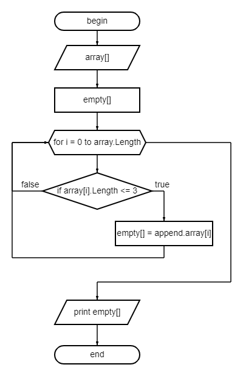

# Итоговый проект 1 четверти
> автор: Виталий Евгеньевич Ч.

Задачи:
1. Создать репозиторий GitHub;
2. Нарисовать блок-схему алгоритма;
3. Снабдить работу описанием решения (+ контроль версий);
4. Написать программу.

## Блок-схема проекта

## Описание решения
*По условию:* Дан массив строк.
1. Заведём пустой массив для записи результата.
2. Для перебора элементов массива воспользуемся циклом с заданными числом повторений:
перебор по индексам начаная с нулевого до длины массива.
Если длина элемента массива меньше или равна трём символам, то записываем его в пустой массив, созданный в шаге 2.
3. Выводим новый массив.